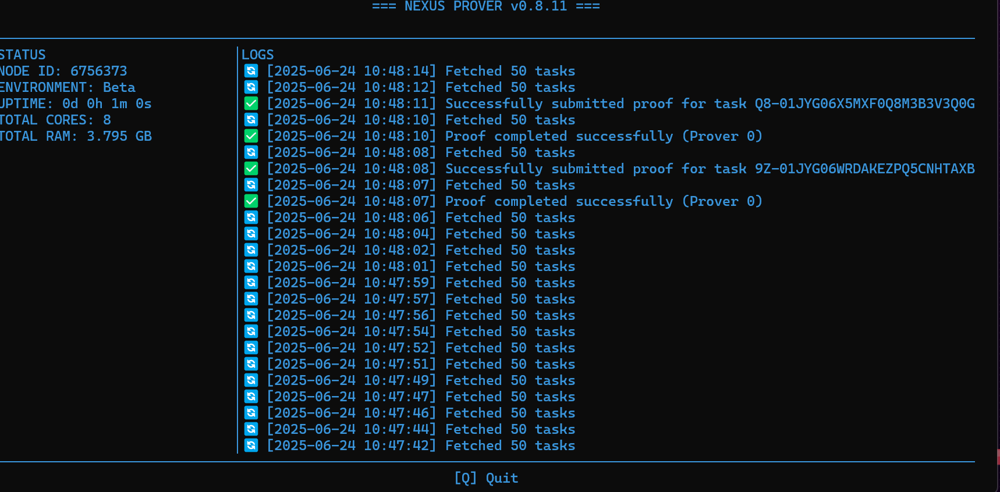

# 🚀 Panduan Instalasi Nexus CLI Node untuk Pemula 

Panduan ini cocok untuk kamu yang baru pertama kali mencoba menjalankan **Nexus Network CLI Node** di device dekstop menggunakan **WSL (Windows Subsystem for Linux)** atau Linux Ubuntu.

> ✅ Cocok untuk: **Windows 10/11 + WSL2 / Ubuntu 20.04+**  
> 🧪 Jaringan: **Testnet Beta**  
> 🧰 Alat: `nexus-network` CLI

---

## 🧩 Apa Itu Nexus CLI Node?

Nexus CLI Node adalah alat baris perintah (Command Line Interface) untuk membantu menjalankan node di jaringan Nexus dan ikut serta dalam proses pembuktian (proving) tugas di testnet.

---

## 📦 Langkah 1: Siapkan WSL (Jika Pakai Windows)

> Jika kamu sudah pakai Linux Ubuntu, lewati langkah ini.

1. Buka **Microsoft Store**
2. Cari dan install: **Ubuntu 22.04 LTS**
3. Setelah selesai, buka aplikasi **Ubuntu** dan buat username & password

---

## 🛠️ Langkah 2: Install Software yang Dibutuhkan

Buka terminal Ubuntu/WSL, lalu jalankan:

```bash
sudo apt update && sudo apt upgrade -y
sudo apt install git curl build-essential pkg-config libssl-dev protobuf-compiler -y
```

---

## 🔧 Langkah 3: Install Rust (Bahasa Pemrograman Nexus CLI)

```bash
curl --proto '=https' --tlsv1.2 -sSf https://sh.rustup.rs | sh
```

Setelah selesai, jalankan:
```bash
source $HOME/.cargo/env
```

Lalu cek apakah sudah berhasil:
```bash
cargo --version
```

---

## 🚀 Langkah 4: Install Nexus CLI (Cara Cepat)

```bash
curl https://cli.nexus.xyz/ | sh
```

Setelah selesai, jalankan:
```bash
source ~/.bashrc
```

---

## ▶️ Langkah 5: Menjalankan Node

### Jika Sudah Punya NODE ID:
```bash
nexus-network start --node-id <masukkan-node-id-kamu>
```

### Jika Belum Punya:

1. Daftarkan wallet kamu:
```bash
nexus-network register-user --wallet-address <alamat-wallet-kamu>
```

2. Daftarkan node:
```bash
nexus-network register-node
```

3. Jalankan node:
```bash
nexus-network start
```

File kredensial kamu akan disimpan di:
```bash
~/.nexus/credentials.json
```

---
## 📸 Tampilan Node Berhasil Jalan



## ❗ Solusi Jika Tiba-Tiba “Killed”

Jika CLI tiba-tiba mati dengan pesan `Killed`, kemungkinan karena WSL kehabisan RAM.  
Ikuti langkah berikut:

1. Buka folder: `C:\Users\<NamaKamu>`
2. Buat file bernama `.wslconfig` (pakai Notepad)
3. Isi dengan:

```ini
[wsl2]
memory=4GB
processors=2
```

4. Simpan, lalu di terminal Windows jalankan:
```bash
wsl --shutdown
```

---

## ✅ Cek Apakah Berhasil

Jika berhasil, kamu akan melihat log seperti:

```
Fetched 50 tasks
Proof completed successfully (Prover 0)
```

---

## 💬 Komunitas dan Bantuan

- Website: [https://nexus.xyz](https://nexus.xyz)
- Dokumentasi: [https://docs.nexus.xyz](https://docs.nexus.xyz)
- Discord Resmi: [https://discord.gg/nexus](https://discord.gg/nexus)
- Join serverku [@ajoika_feb](https://discord.gg/KzVBHKf9ck)

---

## 🏁 Siap Jalan!

Sekarang node kamu sudah aktif dan membantu jaringan Nexus 🎉  
Selamat bergabung di testnet!
Kalau bingung,join aja discord komunitas atau discordku 

